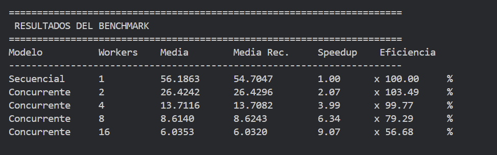
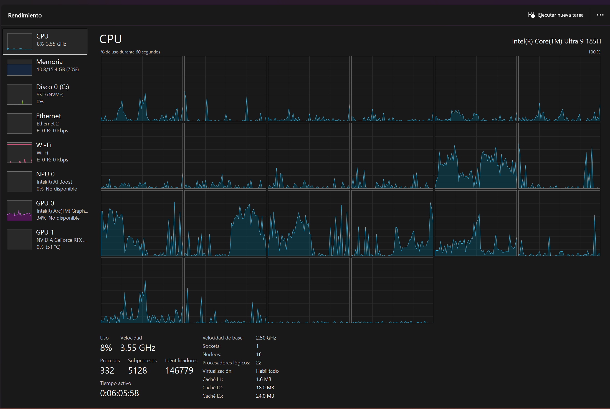
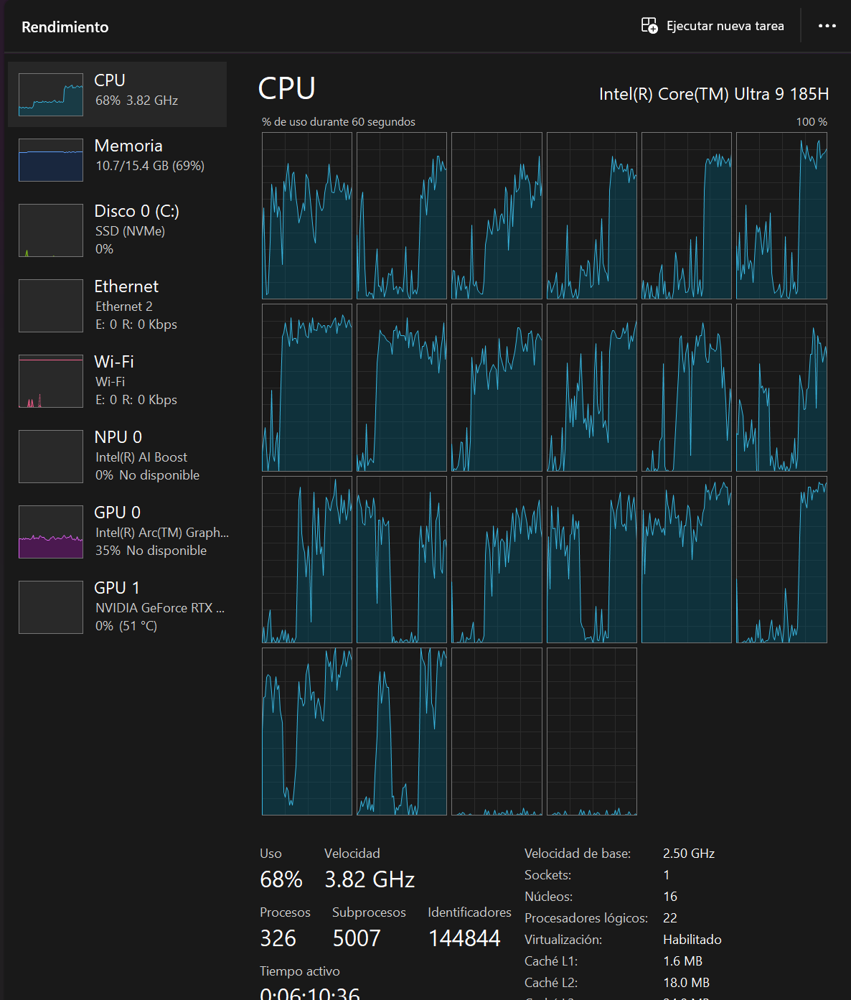
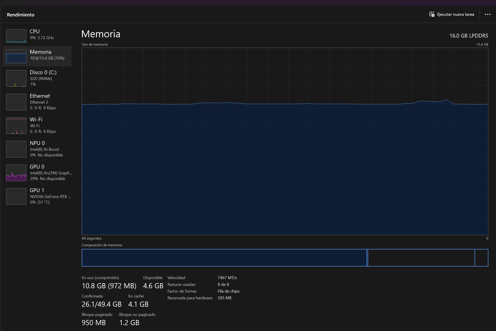
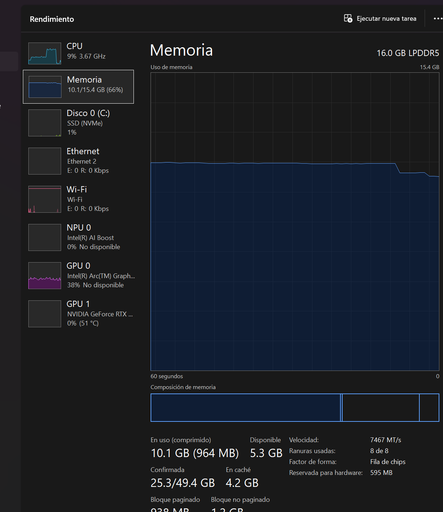

# Resultados del benchmark K-Means (secuencial vs. concurrente) 
Resultados de la ejecución completa del benchmark del Entregable 2 (PC2), con evidencia de uso de recursos.
Todos los datos de este documento provienen de la salida real del programa (`go run ./src`) y de capturas del Administrador de tareas.

## 1. Equipo y entorno

| Componente | Detalle |
|---|---|
| Procesador | Intel Core Ultra 9 185H |
| Núcleos / procesadores lógicos | 16 / 22 |
| Memoria RAM | 16 GB LPDDR5 (15.4 GB utilizables) |
| Sistema operativo | Windows 11 |
| Go | go1.27.1 |
| GOMAXPROCS | 22 |
| Commit del código evaluado | `[completar con: git rev-parse --short HEAD]` |

## 2. Configuración del experimento

| Parámetro | Valor |
|---|---|
| Dataset de entrada | `kmeans_input.csv`: 3,454,475 perfiles × 48 características |
| Valores almacenados | 165,814,800 `float32` (≈ 663 MB) |
| Tiempo de carga del CSV | 9.1450985 s (fuera de la medición) |
| K | 4 |
| Semilla | 42 |
| Máximo de iteraciones / tolerancia | 100 / 1e-6 |
| Repeticiones por configuración | 10 |
| Workers evaluados | 1 (secuencial), 2, 4, 8 y 16 |
| Métrica principal | Media recortada (se descartan el mínimo y el máximo de las 10 mediciones) |

## 3. Resultado de referencia (K-Means secuencial)

| Concepto | Valor |
|---|---|
| Iteraciones hasta converger | 67 |
| Inercia final | 50,693.51312624 |
| Cluster 0 | 684,260 perfiles (19.81%) |
| Cluster 1 | 1,124,853 perfiles (32.56%) |
| Cluster 2 | 933,764 perfiles (27.03%) |
| Cluster 3 | 711,598 perfiles (20.60%) |

Las 40 ejecuciones concurrentes (10 por cada configuración de 2, 4, 8 y 16 workers) devolvieron `Resultado correcto: true`: mismas iteraciones, misma inercia y mismos conteos por cluster que el secuencial.

## 4. Resultados

Speedup = T_secuencial / T_concurrente (ambos con media recortada). Eficiencia = Speedup / número de workers.

| Versión | Workers | Media (s) | Media recortada (s) | Desv. est. (s) | Speedup | Eficiencia | Resultado correcto |
|---|---|---|---|---|---|---|---|
| Secuencial | 1 | 56.1863 | 54.7047 | 5.4407 | 1.00× | 100.00% | Referencia |
| Concurrente | 2 | 26.4242 | 26.4296 | 0.1326 | 2.07× | 103.49% | 10 / 10 |
| Concurrente | 4 | 13.7116 | 13.7082 | 0.0483 | 3.99× | 99.77% | 10 / 10 |
| Concurrente | 8 | 8.6140 | 8.6243 | 0.0939 | 6.34× | 79.29% | 10 / 10 |
| Concurrente | 16 | 6.0353 | 6.0320 | 0.0524 | 9.07× | 56.68% | 10 / 10 |



### Reducción de tiempo respecto al secuencial

| Workers | Media recortada (s) | Reducción |
|---|---|---|
| 2 | 26.4296 | 51.69% |
| 4 | 13.7082 | 74.94% |
| 8 | 8.6243 | 84.23% |
| 16 | 6.0320 | 88.97% |

### Ganancia al duplicar los workers

| Transición | Ganancia de velocidad |
|---|---|
| 1 → 2 | 2.07× |
| 2 → 4 | 1.93× |
| 4 → 8 | 1.59× |
| 8 → 16 | 1.43× |

### Tiempo de cada ejecución (s)

| Ejecución | Secuencial | 2 workers | 4 workers | 8 workers | 16 workers |
|---|---|---|---|---|---|
| 1 | 70.8742 | 26.2266 | 13.6329 | 8.4241 | 5.9667 |
| 2 | 54.8639 | 26.3512 | 13.7029 | 8.5491 | 6.0435 |
| 3 | 53.5487 | 26.5370 | 13.8179 | 8.6347 | 6.0442 |
| 4 | 53.6438 | 26.3788 | 13.7118 | 8.5430 | 6.0863 |
| 5 | 53.3509 | 26.5900 | 13.7216 | 8.5721 | 6.1302 |
| 6 | 53.6718 | 26.4346 | 13.7022 | 8.6937 | 5.9820 |
| 7 | 54.7734 | 26.5132 | 13.6947 | 8.6089 | 5.9749 |
| 8 | 59.2005 | 26.5649 | 13.6979 | 8.6855 | 6.0449 |
| 9 | 54.2958 | 26.4305 | 13.6802 | 8.7077 | 6.0685 |
| 10 | 53.6398 | 26.2149 | 13.7540 | 8.7214 | 6.0120 |

## 5. Observaciones

- El escalamiento es casi lineal hasta 4 workers (2.07× y 3.99×). Con 8 workers el speedup es 6.34× (79.29%) y con 16 llega a 9.07× (56.68%): a partir de 4 workers cada worker adicional aporta menos.
- La versión secuencial fue la más variable (desviación estándar de 5.44 s, coeficiente de variación de 9.68%): dos ejecuciones lentas (70.8742 s y 59.2005 s) frente a un grupo central de 53.35 a 54.86 s. Las versiones concurrentes fueron muy estables (coeficientes de variación entre 0.4% y 1.1%). Por eso se usa la media recortada.
- Con 2 workers la eficiencia es de 103.49%, ligeramente superior al ideal. Contra la mejor ejecución secuencial (53.35 s) el speedup sería 2.02×; como la diferencia es de 2 a 3%, no se le atribuye una causa concluyente.
- La caída de eficiencia con 8 y 16 workers es coherente con que el procesador tenga solo 6 núcleos de alto rendimiento (el resto son núcleos eficientes y de bajo consumo). Es una hipótesis: no se midió en qué núcleo se ejecutó cada worker.

## 6. Uso de recursos (Administrador de tareas)

Valores instantáneos al momento de cada captura, con la vista de CPU por procesador lógico.

| Fase | Uso total de CPU | Velocidad | Procesadores lógicos equivalentes | Memoria del sistema en uso |
|---|---|---|---|---|
| Secuencial | 8% | 3.55 GHz | ≈ 1.8 de 22 | 10.8 GB (70%) |
| Concurrente, 16 workers | 68% | 3.82 GHz | ≈ 15 de 22 | 10.7 GB (69%) |

**CPU secuencial** (carga equivalente a un solo hilo; Windows lo traslada entre núcleos, por eso ningún gráfico queda al 100%):



**CPU con 16 workers** (unos 15 procesadores lógicos ocupados; los dos últimos permanecen prácticamente inactivos):



**Memoria**

El Administrador de tareas informa la memoria de todo el sistema, no la del programa, por lo que la diferencia entre 10.8 GB y 10.7 GB es ruido de otras aplicaciones y no es atribuible al algoritmo. Lo observable es que la curva se mantiene plana en ambas fases. El consumo esperado del programa es 165,814,800 valores × 4 bytes ≈ 663 MB, que todos los workers comparten en solo lectura. Al terminar la ejecución de 16 workers, la curva desciende cerca de 0.6 GB (de unos 10.7 a 10.1 GB), coherente con la liberación de la memoria del programa.





## 7. Cómo reproducir

1. Generar `notebooks/data/kmeans_input.csv` ejecutando `notebooks/preparacion_kmeans.ipynb`.
2. Desde la raíz del repositorio (PowerShell), con la laptop conectada a la corriente y sin otras aplicaciones abiertas:

```powershell
go run ./src | Tee-Object resultados.txt
```

3. Para una prueba rápida, cambiar temporalmente `Repeticiones = 10` a `3` en `src/main.go`. Los resultados oficiales usan 10.

## 8. Salida completa de la consola

<details>
<summary>Ver salida completa del programa</summary>

```text
PS C:\Users\dserr\Desktop\Concurrente\concurrent-kmeans-energy-go> go run ./src
========================================
 K-MEANS - CONSUMO ELÉCTRICO
 BENCHMARK SECUENCIAL VS CONCURRENTE
========================================

💻 INFORMACIÓN DEL SISTEMA
CPUs lógicos disponibles: 22
GOMAXPROCS: 22

📂 Cargando dataset...
✅ Dataset cargado correctamente
Filas: 3454475
Features: 48
Valores almacenados: 165814800
Tiempo de carga: 9.1450985s

⚙️ CONFIGURACIÓN
K: 4
Seed: 42
Máximo de iteraciones: 100
Tolerancia: 0.00000100
Repeticiones por configuración: 10

🎯 Inicializando centroides...
✅ Centroides inicializados

========================================
 BENCHMARK SECUENCIAL
========================================
Ejecución 1/10: 70.8742 segundos
Ejecución 2/10: 54.8639 segundos
Ejecución 3/10: 53.5487 segundos
Ejecución 4/10: 53.6438 segundos
Ejecución 5/10: 53.3509 segundos
Ejecución 6/10: 53.6718 segundos
Ejecución 7/10: 54.7734 segundos
Ejecución 8/10: 59.2005 segundos
Ejecución 9/10: 54.2958 segundos
Ejecución 10/10: 53.6398 segundos

========================================
 RESULTADO DE REFERENCIA
========================================
Iteraciones: 67
Inercia: 50693.51312624

Distribución por cluster:
Cluster 0: 684260 perfiles (19.81%)
Cluster 1: 1124853 perfiles (32.56%)
Cluster 2: 933764 perfiles (27.03%)
Cluster 3: 711598 perfiles (20.60%)

========================================
 BENCHMARK CONCURRENTE - 2 WORKERS
========================================
Ejecución 1/10: 26.2266 segundos | Resultado correcto: true
Ejecución 2/10: 26.3512 segundos | Resultado correcto: true
Ejecución 3/10: 26.5370 segundos | Resultado correcto: true
Ejecución 4/10: 26.3788 segundos | Resultado correcto: true
Ejecución 5/10: 26.5900 segundos | Resultado correcto: true
Ejecución 6/10: 26.4346 segundos | Resultado correcto: true
Ejecución 7/10: 26.5132 segundos | Resultado correcto: true
Ejecución 8/10: 26.5649 segundos | Resultado correcto: true
Ejecución 9/10: 26.4305 segundos | Resultado correcto: true
Ejecución 10/10: 26.2149 segundos | Resultado correcto: true

========================================
 BENCHMARK CONCURRENTE - 4 WORKERS
========================================
Ejecución 1/10: 13.6329 segundos | Resultado correcto: true
Ejecución 2/10: 13.7029 segundos | Resultado correcto: true
Ejecución 3/10: 13.8179 segundos | Resultado correcto: true
Ejecución 4/10: 13.7118 segundos | Resultado correcto: true
Ejecución 5/10: 13.7216 segundos | Resultado correcto: true
Ejecución 6/10: 13.7022 segundos | Resultado correcto: true
Ejecución 7/10: 13.6947 segundos | Resultado correcto: true
Ejecución 8/10: 13.6979 segundos | Resultado correcto: true
Ejecución 9/10: 13.6802 segundos | Resultado correcto: true
Ejecución 10/10: 13.7540 segundos | Resultado correcto: true

========================================
 BENCHMARK CONCURRENTE - 8 WORKERS
========================================
Ejecución 1/10: 8.4241 segundos | Resultado correcto: true
Ejecución 2/10: 8.5491 segundos | Resultado correcto: true
Ejecución 3/10: 8.6347 segundos | Resultado correcto: true
Ejecución 4/10: 8.5430 segundos | Resultado correcto: true
Ejecución 5/10: 8.5721 segundos | Resultado correcto: true
Ejecución 6/10: 8.6937 segundos | Resultado correcto: true
Ejecución 7/10: 8.6089 segundos | Resultado correcto: true
Ejecución 8/10: 8.6855 segundos | Resultado correcto: true
Ejecución 9/10: 8.7077 segundos | Resultado correcto: true
Ejecución 10/10: 8.7214 segundos | Resultado correcto: true

========================================
 BENCHMARK CONCURRENTE - 16 WORKERS
========================================
Ejecución 1/10: 5.9667 segundos | Resultado correcto: true
Ejecución 2/10: 6.0435 segundos | Resultado correcto: true
Ejecución 3/10: 6.0442 segundos | Resultado correcto: true
Ejecución 4/10: 6.0863 segundos | Resultado correcto: true
Ejecución 5/10: 6.1302 segundos | Resultado correcto: true
Ejecución 6/10: 5.9820 segundos | Resultado correcto: true
Ejecución 7/10: 5.9749 segundos | Resultado correcto: true
Ejecución 8/10: 6.0449 segundos | Resultado correcto: true
Ejecución 9/10: 6.0685 segundos | Resultado correcto: true
Ejecución 10/10: 6.0120 segundos | Resultado correcto: true

======================================================================
 RESULTADOS DEL BENCHMARK
======================================================================
Modelo          Workers    Media        Media Rec.     Speedup    Eficiencia  
----------------------------------------------------------------------
Secuencial      1          56.1863      54.7047        1.00      x 100.00     %
Concurrente     2          26.4242      26.4296        2.07      x 103.49     %
Concurrente     4          13.7116      13.7082        3.99      x 99.77      %
Concurrente     8          8.6140       8.6243         6.34      x 79.29      %
Concurrente     16         6.0353       6.0320         9.07      x 56.68      %

========================================
 TIEMPOS INDIVIDUALES
========================================

Secuencial - 1 worker(s):
  Ejecución 1: 70.8742 segundos
  Ejecución 2: 54.8639 segundos
  Ejecución 3: 53.5487 segundos
  Ejecución 4: 53.6438 segundos
  Ejecución 5: 53.3509 segundos
  Ejecución 6: 53.6718 segundos
  Ejecución 7: 54.7734 segundos
  Ejecución 8: 59.2005 segundos
  Ejecución 9: 54.2958 segundos
  Ejecución 10: 53.6398 segundos

Concurrente - 2 worker(s):
  Ejecución 1: 26.2266 segundos
  Ejecución 2: 26.3512 segundos
  Ejecución 3: 26.5370 segundos
  Ejecución 4: 26.3788 segundos
  Ejecución 5: 26.5900 segundos
  Ejecución 6: 26.4346 segundos
  Ejecución 7: 26.5132 segundos
  Ejecución 8: 26.5649 segundos
  Ejecución 9: 26.4305 segundos
  Ejecución 10: 26.2149 segundos

Concurrente - 4 worker(s):
  Ejecución 1: 13.6329 segundos
  Ejecución 2: 13.7029 segundos
  Ejecución 3: 13.8179 segundos
  Ejecución 4: 13.7118 segundos
  Ejecución 5: 13.7216 segundos
  Ejecución 6: 13.7022 segundos
  Ejecución 7: 13.6947 segundos
  Ejecución 8: 13.6979 segundos
  Ejecución 9: 13.6802 segundos
  Ejecución 10: 13.7540 segundos

Concurrente - 8 worker(s):
  Ejecución 1: 8.4241 segundos
  Ejecución 2: 8.5491 segundos
  Ejecución 3: 8.6347 segundos
  Ejecución 4: 8.5430 segundos
  Ejecución 5: 8.5721 segundos
  Ejecución 6: 8.6937 segundos
  Ejecución 7: 8.6089 segundos
  Ejecución 8: 8.6855 segundos
  Ejecución 9: 8.7077 segundos
  Ejecución 10: 8.7214 segundos

Concurrente - 16 worker(s):
  Ejecución 1: 5.9667 segundos
  Ejecución 2: 6.0435 segundos
  Ejecución 3: 6.0442 segundos
  Ejecución 4: 6.0863 segundos
  Ejecución 5: 6.1302 segundos
  Ejecución 6: 5.9820 segundos
  Ejecución 7: 5.9749 segundos
  Ejecución 8: 6.0449 segundos
  Ejecución 9: 6.0685 segundos
  Ejecución 10: 6.0120 segundos

🏁 Benchmark finalizado
```

</details>
